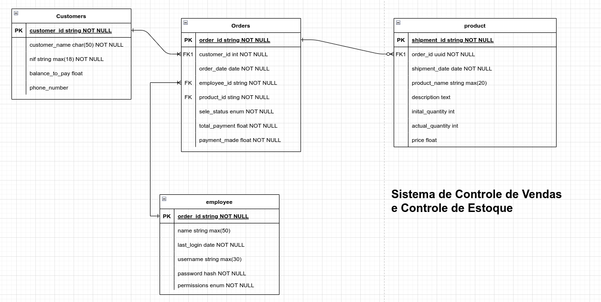

# Documentação do Projeto: Sistema de Gestão de Estoque

## Descrição e Features

O Sistema de Gestão de Estoque, é uma aplicação desenvolvida para um armazém de bebidas, localizado no Benfica. Ele visa otimizar e automatizar o controle dos produtos, vendas, clientes, e funcionários do armazém.
Requisitos Funcionais:

### O sistema deve atender aos seguintes requisitos funcionais:

- CRUD (Criação, Leitura, Atualização e Delete) dos Produtos: Permitir a gestão completa dos produtos vendidos no armazém, incluindo a adição, consulta, atualização e exclusão de registros.

- Relatórios de Venda: Gerar relatórios de venda diários, semanais e trimestrais para fornecer uma visão abrangente das atividades comerciais.

- Alertas de Estoque Baixo: Gerar alertas quando os produtos estiverem prestes a acabar em estoque, permitindo uma reposição proativa.

- Relatórios e Alertas de Clientes em Dívida: Fornecer relatórios sobre clientes com produtos em dívida e alertas para a administração sobre essa situação.

- Gestão de Funcionários: Permitir o gerenciamento eficiente dos funcionários, incluindo suas informações pessoais, funções e permissões.

## Etapas de Desenvolvimento:

- [ ] Concepção e Elaboração da Base de Dados: Definir a estrutura da base de dados que suportará todas as operações do sistema, incluindo tabelas para produtos, vendas, clientes e funcionários.

- [ ] Criação da Estrutura Lógica do Sistema: Desenvolver a lógica de negócios do sistema, incluindo a implementação dos CRUDs, a lógica para geração de relatórios e alertas.

- [ ] Criação da Interface Gráfica: Desenvolver uma interface gráfica amigável e intuitiva para os usuários interagirem com o sistema, facilitando o acesso e a utilização das funcionalidades.

- [ ] Conexão dos Módulos do Sistema: Integrar todos os módulos desenvolvidos, garantindo uma comunicação eficiente entre eles para um funcionamento coeso e integrado do sistema.

## Entidades:

1. **Produto:**
   - Atributos: ID (identificador único), Nome, Descrição, Quantidade em Estoque, Preço.

2. **Venda:**
   - Atributos: ID, Data da Venda, Total da Venda, Produtos Vendidos.

3. **Cliente:**
   - Atributos: ID, Nome, Endereço, Dívidas.

4. **Funcionário:**
   - Atributos: ID, Nome, Cargo, Permissões.

## Relacionamentos:

1. **Produto - Venda:**
   - Um Produto pode estar presente em várias Vendas.
   - Uma Venda pode ter vários Produtos.

2. **Cliente - Venda:**
   - Um Cliente pode realizar várias Vendas.
   - Uma Venda é realizada por um único Cliente.

3. **Produto - Alerta de Estoque:**
   - Um Produto pode estar associado a vários Alertas de Estoque.
   - Um Alerta de Estoque está associado a um único Produto.

4. **Cliente - Alerta de Dívida:**
   - Um Cliente pode estar associado a vários Alertas de Dívida.
   - Um Alerta de Dívida está associado a um único Cliente.

5. **Funcionário - Venda:**
   - Um Funcionário pode estar associado a várias Vendas.
   - Uma Venda é realizada por um único Funcionário.

## Taferas Realizadas

   ## ER - Entidade Relacional
   